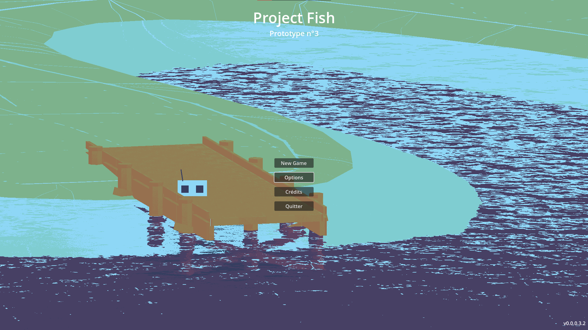
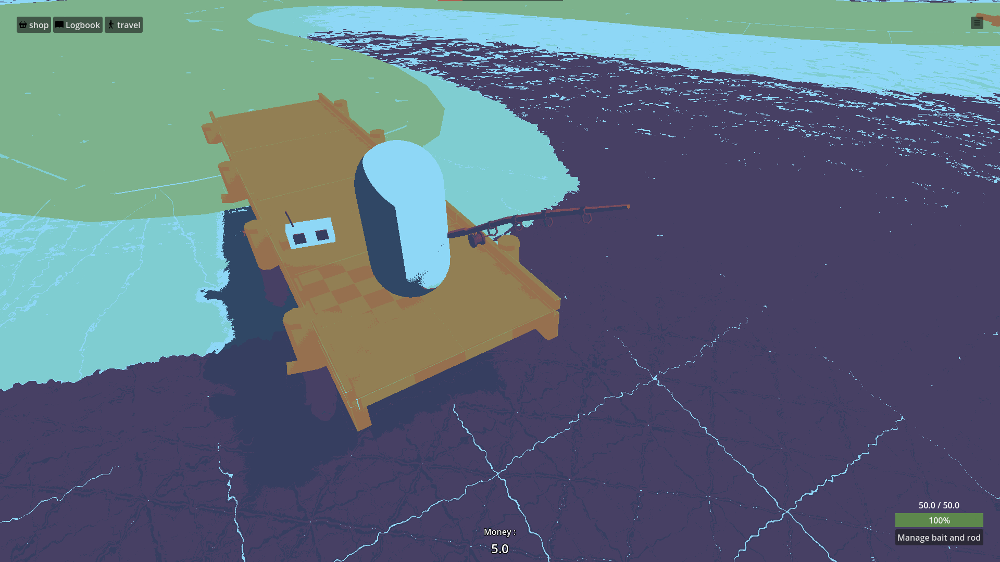
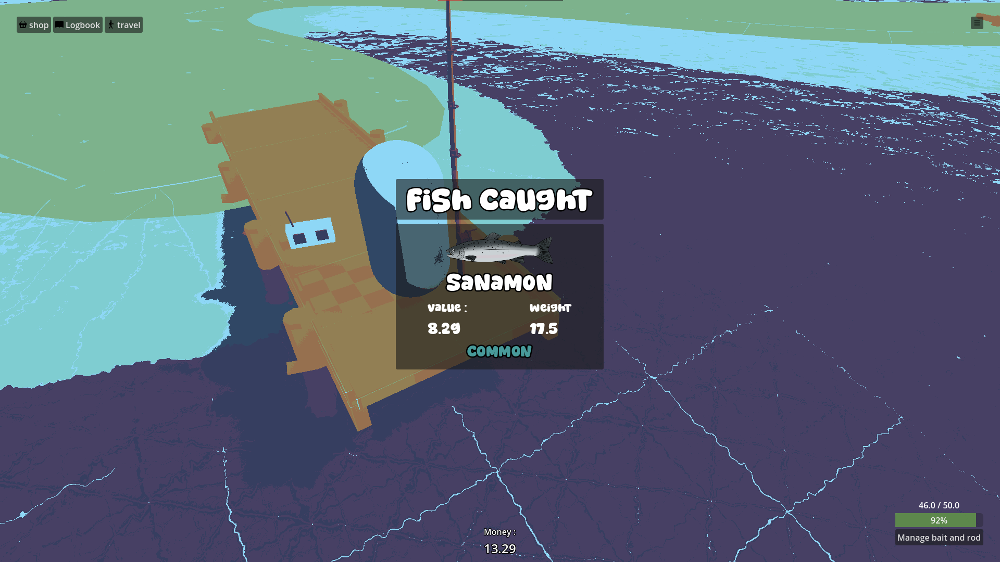
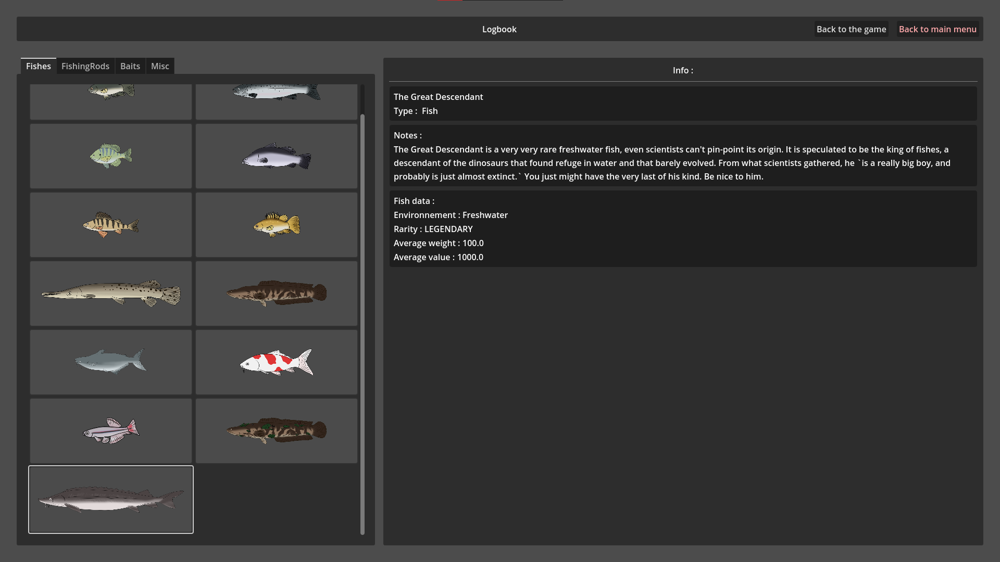
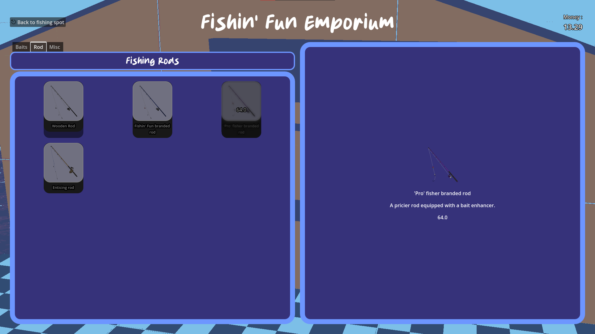

# project-fish

Third Godot project. As of the 24th of August 2026, it has been archived. All of my code is open source. I do not claim ownership of copyrighted content included in this prototype build.

## Goal of the project

This project's goal is to "make a small game", as every youtube gamemaking tutorial puts it.

A cozy and simple fishing game with no deeper mechanics than that. The goal is to make a game that is a good phone distraction while waiting for the bus or something like that. Open the game, fish a few fishes, sell them and buy upgrades for next time.

## Screenshots

### Main Menu

### Main Screen

### Fish caught !

### Logbook

### Shop

# Third party Credits

## Addons

Addons can be catagorized this way :

- Editor Addons : only affect how the creator implements content. Is completely unseen by the user.
- Content Addons : either creates content, is content, or does the programming work for you.

### Editor addons

<a href="https://github.com/nathanhoad/godot_sound_manager">Godot Sound Manager</a>

<a href="https://github.com/Firch/SceneContainer">Scene container (not yet used, for later)</a>

<a href="https://github.com/SoulsTogetherX/Godot-Free-Control/tree/main/">Free control</a>

<a href="https://github.com/Ibenyourbro/ui-outline"> Ui outline</a>

### Content Addons

<a href="https://github.com/H2xDev/GodotVMF">GodotVMF</a>

## Shader(s?)

<a href="https://godotshaders.com/shader/snap-screen-colors-to-palette-posterize/">Snap Screen Colors to Palette (Posterize)</a>

## Fonts

<a href="https://www.dafont.com/fr/super-trend.font">Super Trend</a>

<a href="https://www.dafont.com/fr/fish-strike.font">Fish Strike</a>

## Textures

<a href="https://www.kenney.nl/assets/prototype-textures"> Prototype Textures by Kenney, Creative Commons CC0 </a>

<a href="https://icons.getbootstrap.com"> Bootstrap Icons </a>

<a href="https://x.com/A_Normal_Tent/">Fishes, baits and fishing rods drawn by WIP_Tent</a>

## Models

<a href="https://poly.pizza/m/0YAR0Lg58p">Fishing Rod by Quaternius</a> - <a href="https://creativecommons.org/publicdomain/zero/1.0/">Public Domain (CC0)</a>

## Sounds

<a href="https://freesound.org/people/paulprit/sounds/507093/">Fish Splashing Release 2.wav</a> by <a href="https://freesound.org/people/paulprit/">paulprit</a> | License: <a href="http://creativecommons.org/publicdomain/zero/1.0/">Creative Commons 0</a>

<a href="https://freesound.org/people/Cinetony/sounds/559542/">Larger stream with crows in forest</a> by <a href="https://freesound.org/people/Cinetony/">Cinetony</a> | License: <a href="http://creativecommons.org/publicdomain/zero/1.0/">Creative Commons 0</a>

<a href="https://freesound.org/people/plasterbrain/sounds/419493/">Bell Chime Alert</a> by <a href="https://freesound.org/people/plasterbrain/">plasterbrain</a> | License: <a href="http://creativecommons.org/publicdomain/zero/1.0/">Creative Commons 0</a>

<a href="https://freesound.org/people/UNIVXRSE_Music_/sounds/803856/">Nebula</a> by <a href="https://freesound.org/people/UNIVXRSE_Music_/">UNIVXRSE*Music*</a> | License: <a href="http://creativecommons.org/publicdomain/zero/1.0/">Creative Commons 0</a>

<a href="https://store.steampowered.com/app/1422450/Deadlock/">Various sounds from Deadlock (placeholder sounds)</a>

<a href="https://www.youtube.com/@gakhed">4 songs by GAKHED. Songs are used without permission, so please please please check him out.</a>

Copyright Rémi "AlexEatDonut" Peautre - 2025  
Hammer editor, software by Valve corporation  
Hammer ++, software extension by Ficool2
